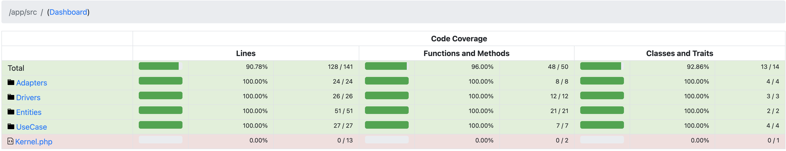

# Authorizer
Application that authorize transactions to a specific account through command line.

Code challenge made for Nubank Software Engineer role.


## Stack
- [Git & Bash](https://git-scm.com/downloads)
- [Docker 20.10.7](https://www.docker.com/products/docker-desktop)
- [Docker Compose 1.29.2](https://docs.docker.com/compose/install/)
- [PHP 8.0](https://www.php.net/downloads.php#v8.0.9)
- [Symfony 5.3.4](https://github.com/symfony/symfony/tree/5.3)
- [PHPUnit 9.5.8](https://github.com/sebastianbergmann/phpunit/tree/9.5)

## Code Coverage


## Instruction
### Build
1) Validate if the `Docker` and `Docker compose` dependencies are already installed;
2) On root of the project, execute the following commands to build the application and install project dependencies;
   ```shell
    chmod +x build
    ```
   ```shell
   ./build
   ```

### Execute
- On the root of the project, execute the following commands to execute the application:
   ```shell
    chmod +x authorizer
    ```
   ```shell
   ./authorizer FILE_PATH
   ```
   Change FILE_PATH to the file path that you want to authorize (some examples are on `files` folder on the root of this project)

### Tests
- To perform tests, execute the following commands:
   ```shell
   chmod +x tests
   ```
  ```shell
   ./tests <TESTS_TYPE>
   ```
  <TEST_TYPE> = Feature|Unit
